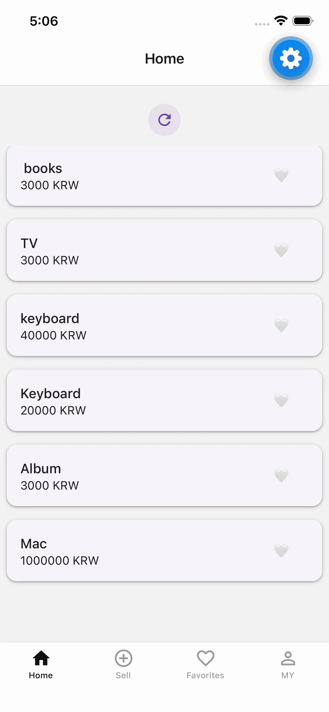

# Market MVP App

Mobile marketplace app where users can post products with photo and manage favorites.

React Native / Expo / TypeScript / React Query / Zustand / React Navigation


---





## Focused on

Maintainable mobile structure with clear responsibility separation.

```txt
Screen      → UI and user intent
Hooks       → feature logic and side effects
Zustand     → client state and persisted state
React Query → server state and cache invalidation
API Client  → authenticated requests and token refresh
```

## Run

```bash
npm install
npm start
```
